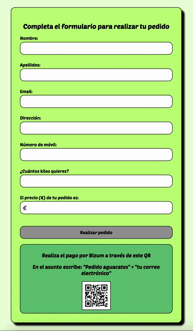

# 🥑 Proyecto Fullstack de e-commerce - **Huerto López**

Proyecto fullstack que simula una tienda online de aguacates, desarrollada como práctica completa de frontend y backend.

<p align="center"></p>

---

## ⚙️ Tecnologías principales

- **Frontend**: React (Create React App) y Axios
- **Backend**: Node.js, Express
- **Base de datos**: PostgreSQL
- **Estilos**: CSS con diseño adaptado a móvil
- **Otros**: Morgan, dotenv, UUID

## 🧱 Estructura del proyecto

```
📁 proyecto-ecommerce-aguacates
├── 📁 client             
├── 📁 server            
└── README.md 
```
[Tutorial consultado para el setup del proyecto](https://dev.to/shanu001x/how-to-setup-full-stack-project-for-production-in-nodejs-environment-2d7l)

## 🚀 Iniciar el proyecto
```bash
git clone https://github.com/tuusuario/proyecto-ecommerce-aguacates.git

cd proyecto-ecommerce-aguacates
```
1. Instala dependencias
```bash
cd server
npm install
```

```bash
cd ../client
npm install
```
2. Iniciar backend y frontend
```bash
cd server
npm run dev
```

```bash
cd ../client
npm start
```

3. 📡 Comunicación cliente-servidor

- El cliente realiza peticiones axios a la API del backend.

- Endpoints principales:

```bash
POST /api/orders → Crear pedido

GET /api/orders/ordersdashboard → Ver todos los pedidos

GET /api/orders/email/:email → Buscar pedidos por correo

PUT /api/orders/:id/state → Cambiar estado del pedido

GET /api/stock → Consultar stock
```

## 🖼️ Funcionalidades
**Cliente**

- Formulario de pedido con validación

- Buscador de pedidos por correo

- Dashboard con todos los pedidos

- Actualización del estado del pedido

- Diseño adaptado a móvil

<p align="center"></p>

**Servidor**

- Rutas organizadas por controladores

- Gestión de usuarios y pedidos

- Conexión a base de datos PostgreSQL

- Actualización del stock tras realizar un pedido

## 👨‍💻 Autor
Proyecto desarrollado por Mario L. Clavero