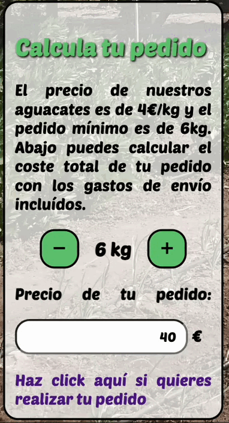
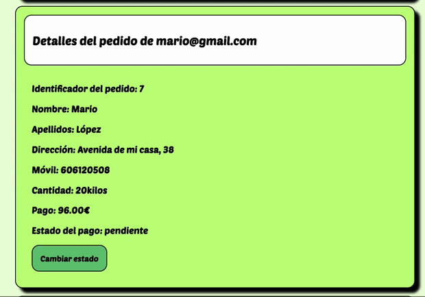

# Frontend de e-commerce aguacates

Este frontend ha sido desarrollado con **React** utilizando `Create React App`.

---

## Arrancar el proyecto

1. Instalar dependencias:

```
npm install
```

2. Inicia la aplicación con el siguiente comando
```
npm start
````


## Estructura del proyecto

```
📁 client/
├── 📁 node_modules/             
│
├── 📁 public/
│
├── 📁 src/
│   ├── assets
│   └── components
│        ├── Header
│        │   └── Nav
│        │ 
│        ├── Main
│        │    ├── About
│        │    │ 
│        │    ├── Dashboard
│        │    │      └── OrderCard
│        │    │   
│        │    ├── Description
│        │    │      ├── Calculator
│        │    │      └── Text
│        │    │
│        │    └── OrderForm
│        │ 
│        └── Footer
│           
├── .gitignore                 
├── {} package-lock.json     
└── {} package.json                        
```

## Componentes principales

```Nav.jsx```

- Menú superior con links.

- Uso de menú hamburguesa.

```Description```

- Calculadora que simula el precio de un pedido en función de los kilos seleccionados.
- Texto descriptivo del producto.



```OrderForm```
- Formulario controlado con useState.
- Validaciones en los inputs con expresiones regulares.
-  Al enviar el formulario, hace una petición POST al backend.

```About```
- Vista dedicada a la implementación de librerías para mejorar la experiencia de usuario
- Petición GET para consultar el stock de aguacates

```Dashboard```
- Panel de control para el administrador donde se cargan por defecto todos los pedidos realizados
- Permite buscar por email de usuario los detalles de sus pedidos
- Uso de los hooks useState y useEffect

```OrderCard```
- Muestra la información detallada de un pedido.
- Funcionalidad para actualizar el pedido de "pendiente" a "pagado" a través de un botón.
- Comunicación por props con Dashboard



## Interfaz de usuario

- Diseño adaptado a móviles
- Tipografía personalizada y paleta de colores que emula el entorno rural

### Librerías utilizadas:
- [React sweetalert2](https://www.npmjs.com/package/react-sweetalert2)
- [Framer motion](https://www.npmjs.com/packageframer-motion)
- [React Responsive Carousel](https://www.npmjs.com/package/react-responsive-carousel)
- [Spinners React](https://www.npmjs.com/package/spinners-react)


