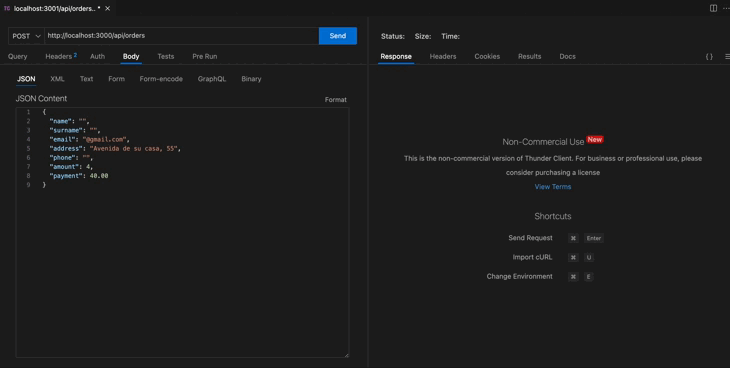

# Backend e-commerce aguacates

Este backend ha sido desarrollado para gestionar los pedidos de aguacates del **Huerto López**, permitiendo registrar usuarios, crear pedidos, consultar stock y administrar pedidos realizados.

## Estructura del proyecto
```
📁 server/
├── 📁 config/
│   └── db_pgsql.js              
│
├── 📁 controllers/
│   ├── aguacates.controller.js            
│   └── order.controller.js  
│
├── 📁 middlewares/
│   └── morgan.js
│
├── 📁 models/
│   ├── aguacates.model.js            
│   ├── order.model.js             
│   └── aguacates.model.js
│
├── 📁 queries/
│   └── api.queries.js      
│
├── 📁 routes/
│   ├── aguacates.routes.js           
│   └── user.routes.js                           
│       
├── ⚙️ .env   
├── {} package-lock.json                         
├── {} package.json  
├── 🐘 queries                  
├── 🗄️server.js
````

## Instalación


1. **Haz Fork y clona el repositorio**
```bash
git clone <url-del-repositorio>
cd server
````
2. **Instala dependencias**
```bash
npm install
````
3. **Crea tu base de datos en PostgreSQL**
- Arranca el contenedor de PostgreSQL
- Si utilizas pgAdmin4 abre Query Tool para insetar las tablas:
```bash
DROP TABLE IF EXISTS orders CASCADE;
DROP TABLE IF EXISTS users CASCADE;
DROP TABLE IF EXISTS aguacates CASCADE;

CREATE TABLE users (
  id_user SERIAL PRIMARY KEY,
  name TEXT NOT NULL,
  surname TEXT NOT NULL,
  email TEXT UNIQUE NOT NULL,
  address TEXT NOT NULL,
  phone TEXT NOT NULL
);

CREATE TABLE orders (
  id_order SERIAL PRIMARY KEY,
  id_user INTEGER REFERENCES users(id_user) ON 
  DELETE CASCADE,
  amount INTEGER NOT NULL,                
  payment NUMERIC(10, 2) NOT NULL,                
  date TIMESTAMP DEFAULT CURRENT_TIMESTAMP,
  state TEXT DEFAULT 'pendiente' CHECK (state IN ('pendiente', 'pagado'))
);

CREATE TABLE aguacates (
  id SERIAL PRIMARY KEY,
  stock_kg INTEGER NOT NULL
);

INSERT INTO aguacates (stock_kg) VALUES (1500);
````
4. **Crea tu archivo ``.env`` en la raíz del proyecto con tus credenciales. Puedes consultar el .env.example**

5. Una vez configurado tu entorno de trabajo, instala ```nodemon``` para no tener que apagar y encender el servidor con cada cambio.

6. Inicia el servidor con el siguiente comando:
```npm run dev```

## Endpoints de la API
| Método | Ruta                          | Descripción                               |
| ------ | ----------------------------- | ----------------------------------------- |
| POST   | `/api/orders`                 | Crear un nuevo pedido                     |
| GET    | `/api/stock`                  | Consultar stock actual de aguacates       |
| GET    | `/api/orders/email/:email`    | Buscar pedidos por correo electrónico     |
| GET    | `/api/orders/ordersdashboard` | Ver todos los pedidos (uso privado/admin) |
| PUT    | `/api/orders/:id/state`       | Cambiar estado del pedido de "pendiente" a "pagado"      |

## Probar API con ThunderClient o Postman
1. Crear un **POST**
- Copia esta URL: ```http://localhost:3000/api/orders```
- En el Body(JSON) introduce este objeto: 

{<br>
     "name": "Usuario", <br>
    "surname": "Apellidos Usuario", <br>
    "email": "correousuario@gmail.com", <br>
    "address": "Dirección de usuario", <br>
    "phone": "Móvil de usuario", <br>
    "amount": 6, <br>
    "payment": 40 <br>
}



2. **GET** - Consulta el stock de aguacates tras realizar el POST (puedes comprobar que la cantidad que introdujiste en al hacer POST se resta al total).

URL: ```http://localhost:3000/api/stock```

3. **GET** - Ver pedidos por correo

URL: ```http://localhost:3000/api/orders/email/correo introducido en el POST```

4. **GET** - Ver todos los pedidos

URL: ```http://localhost:3000/api/orders/ordersdashboard```

5. **PUT** - Cambiar estado de un pedido de pendiente (por defecto) a "pagado"

URL: ```http://localhost:3000/api/orders/:id/state```

(Reemplaza id por el id_order correspondiente)


